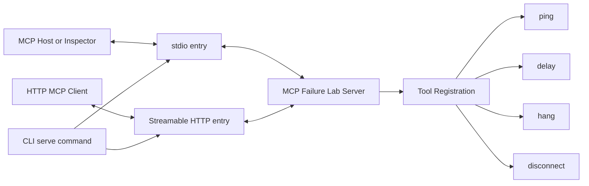
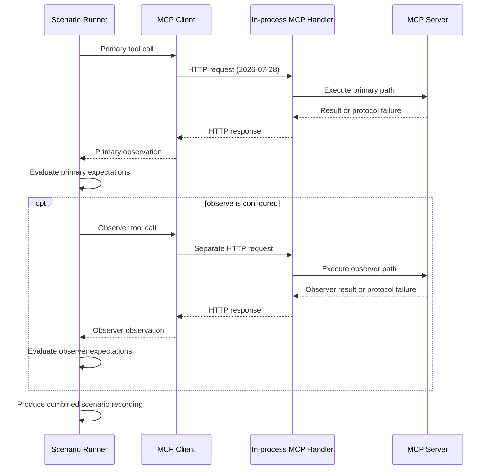
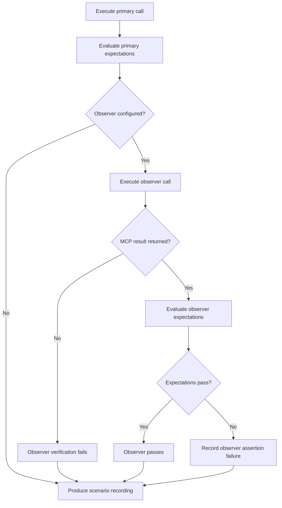

## Server and transport path

The `serve` command exposes the same registered tools over stdio or Streamable HTTP. Stdio remains the default. Both transports reuse `createServer`, so fault behavior is defined once.

_Figure 1. Stdio and Streamable HTTP share one server factory._

The public HTTP entry serves `2026-07-28` per request and provides stateless `2025-11-25` compatibility. It validates the endpoint path and the `Host` and `Origin` headers before dispatching into the SDK handler. The default listener is `127.0.0.1:3000`, and wildcard binds are rejected.

## Scenario execution path

Failure Lab uses a real MCP client/server path. Built-in scenarios target `2026-07-28` through the SDK v2 in-process HTTP handler. This handler is internal to scenario execution; it does not expose a public HTTP endpoint. Fault behavior lives in the registered tools rather than in a proxy or a second simulation layer.

_Figure 2. Primary and optional observer calls execute sequentially._

## Responsibilities

The server path separates five responsibilities:

1. The CLI parses commands and starts `serve`.
2. The selected transport exchanges MCP messages over stdio or Streamable HTTP.
3. `createServer` constructs the server without starting I/O.
4. `ping` supplies a deterministic health path.
5. `delay`, `hang`, and `disconnect` reproduce controlled failures.

Server construction and execution stay separate so both public transports and the built-in scenario handler reuse the same server configuration. When stdio is active, stdout is reserved for MCP traffic and diagnostics go to stderr. HTTP shutdown stops new ingress, closes the listener, and releases active MCP resources.

## Primary and observer calls

The runner records the primary observation and evaluates its expectations. When `observe` is configured, it then performs a separate tool call on the same MCP client connection. Observer results remain separate in the recording, while their assertion failures contribute to the overall scenario status.

_Figure 3. Observer verification and failure handling._

:::note[Deliberate boundary]
The current architecture is not a proxy and does not orchestrate external MCP clients. Target-client adapters remain future work.
:::
