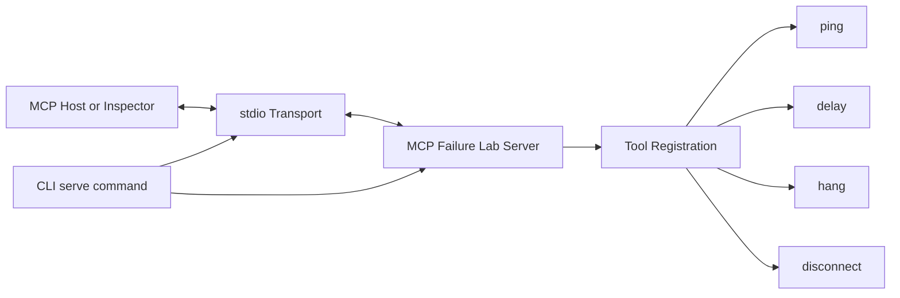
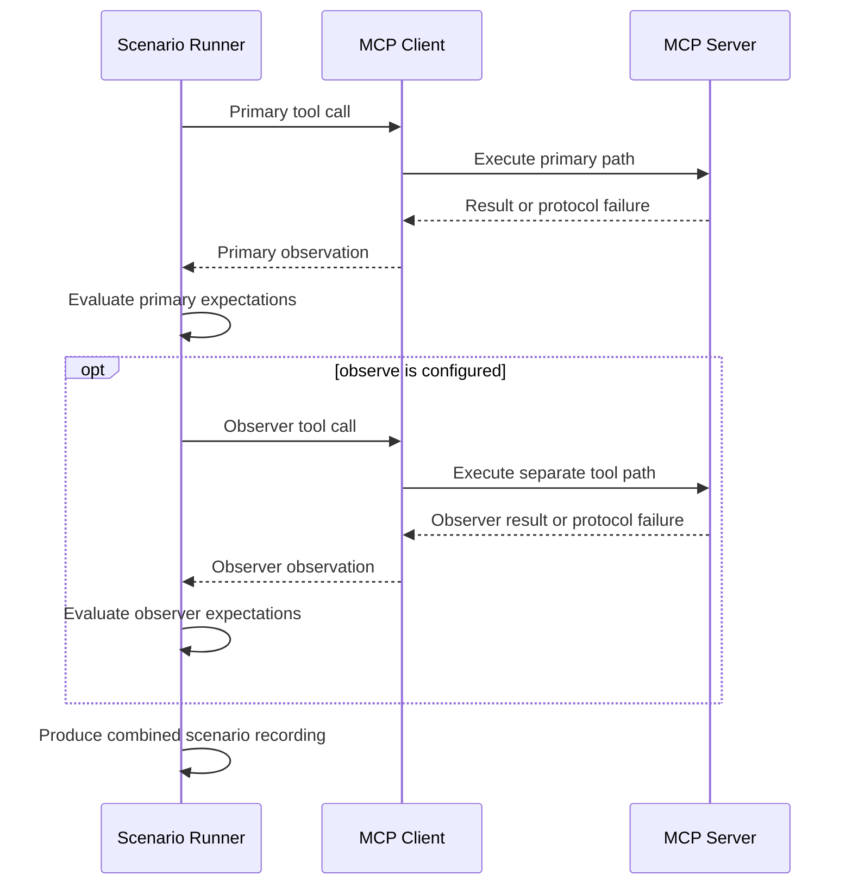
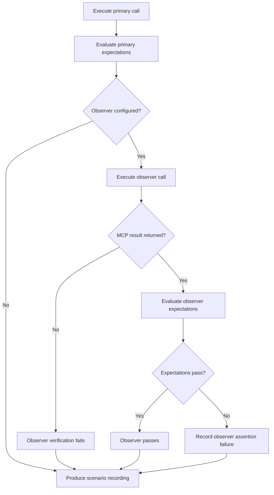

## Server and transport path

The built-in server exposes the same registered tools to an MCP host or Inspector over stdio. Server construction stays separate from transport startup, so the tool configuration can also be reused by scenario tests.

*Figure 1. Current server and stdio transport architecture.*

## Scenario execution path

Failure Lab uses a real MCP client/server path. Fault behavior lives in the registered tools rather than in a proxy or a second simulation layer.

*Figure 2. Primary and optional observer calls execute sequentially.*

## Responsibilities

The stdio server path separates five responsibilities:

1. The CLI parses commands and starts `serve`.
2. `StdioServerTransport` exchanges MCP messages over stdin and stdout.
3. `createServer` constructs the server without starting I/O.
4. `ping` supplies a deterministic health path.
5. `delay`, `hang`, and `disconnect` reproduce controlled failures.

Server construction and execution stay separate so integration tests and future transports can reuse the same server configuration. When stdio is active, stdout is reserved for MCP traffic and diagnostics go to stderr.

## Primary and observer calls

The runner records the primary observation and evaluates its expectations. When `observe` is configured, it then performs a separate tool call on the same MCP client connection. Observer results remain separate in the recording, while their assertion failures contribute to the overall scenario status.

*Figure 3. Observer verification and failure handling.*

:::note[Deliberate boundary]
The current architecture is not a proxy and does not orchestrate external MCP clients. Streamable HTTP and target-client adapters are future work.
:::
