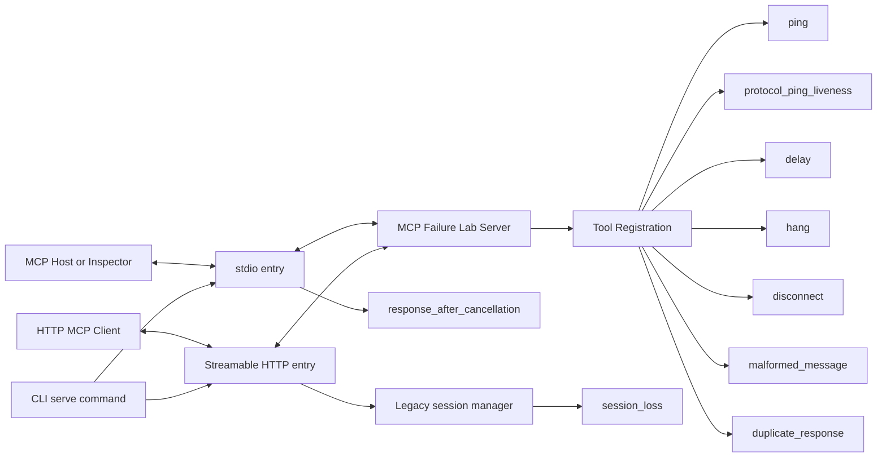
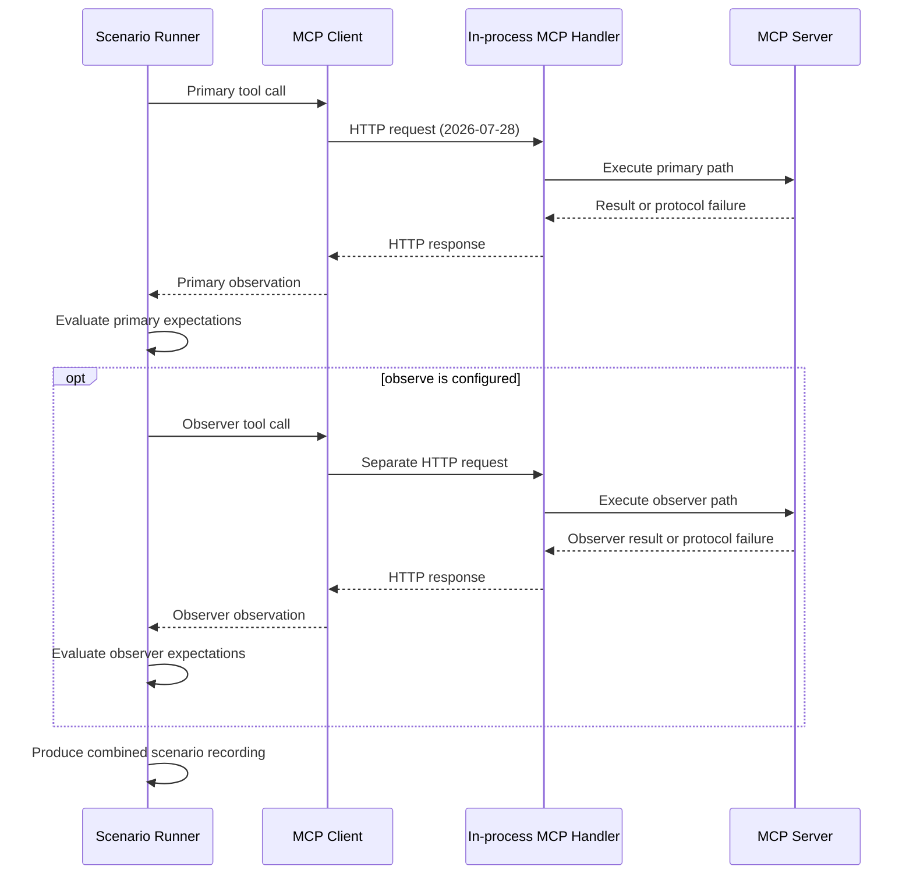
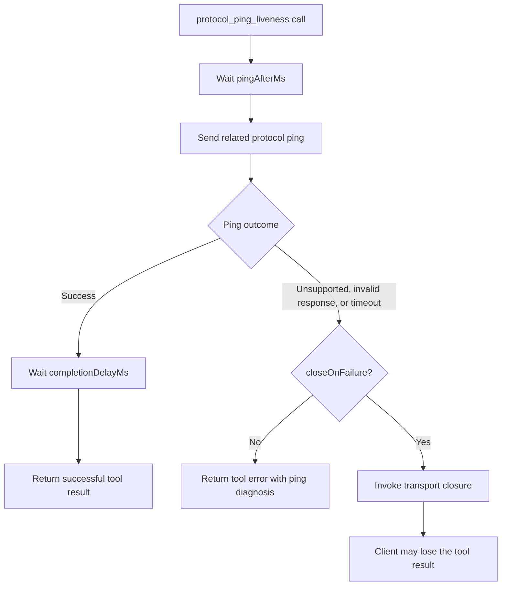
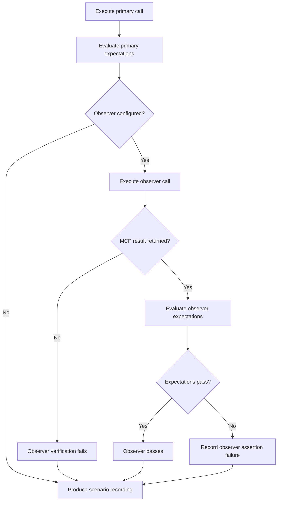
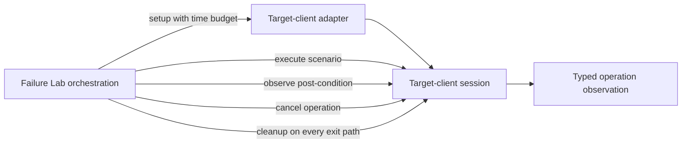

## Server and transport path

The `serve` command exposes the shared fault tools over stdio and Streamable HTTP. Stdio remains the default. Both transports reuse `createServer`, while transport-specific tools are registered only where their behavior can be isolated safely.


```mermaid
graph LR
    Host[MCP Host or Inspector] <--> Stdio[stdio entry]
    HttpClient[HTTP MCP Client] <--> Http[Streamable HTTP entry]
    Stdio <--> Server[MCP Failure Lab Server]
    Http <--> Server
    Server --> Registration[Tool Registration]
    Registration --> Ping[ping]
    Registration --> Liveness[protocol_ping_liveness]
    Registration --> Delay[delay]
    Registration --> Hang[hang]
    Registration --> Disconnect[disconnect]
    Registration --> Malformed[malformed_message]
    Registration --> Duplicate[duplicate_response]
    Stdio --> LateResponse[response_after_cancellation]
    Http --> LegacySessions[Legacy session manager]
    LegacySessions --> SessionLoss[session_loss]
    CLI[CLI serve command] --> Stdio
    CLI --> Http
```

_Figure 1. The transports share one server factory and add transport-specific faults where needed._

The public HTTP entry serves `2026-07-28` per request. Initialized `2025-11-25` clients receive a session ID and keep a dedicated server and transport until that session closes. Legacy requests without a session remain stateless for compatibility. The entry validates the endpoint path and the `Host` and `Origin` headers before dispatching into the SDK handler. The default listener is `127.0.0.1:3000`, and wildcard binds are rejected.

## Scenario execution path

Failure Lab uses a real MCP client/server path. Built-in scenarios default to `2026-07-28` through the SDK v2 in-process HTTP handler. This handler is internal to scenario execution; it does not expose a public HTTP endpoint. Setting scenario `protocolVersion` to `"2025-11-25"` uses linked in-memory transports with a legacy client and the same server factory. Legacy transport decorators preserve malformed and duplicate response faults. Both paths close their client and server resources after execution. Tool handlers activate faults; malformed responses are changed at the transport boundary rather than returned as ordinary tool errors.


```mermaid
sequenceDiagram
    participant Runner as Scenario Runner
    participant Client as MCP Client
    participant Handler as In-process MCP Handler
    participant Server as MCP Server

    Runner->>Client: Primary tool call
    Client->>Handler: HTTP request (2026-07-28)
    Handler->>Server: Execute primary path
    Server-->>Handler: Result or protocol failure
    Handler-->>Client: HTTP response
    Client-->>Runner: Primary observation
    Runner->>Runner: Evaluate primary expectations

    opt observe is configured
        Runner->>Client: Observer tool call
        Client->>Handler: Separate HTTP request
        Handler->>Server: Execute observer path
        Server-->>Handler: Observer result or protocol failure
        Handler-->>Client: HTTP response
        Client-->>Runner: Observer observation
        Runner->>Runner: Evaluate observer expectations
    end

    Runner->>Runner: Produce combined scenario recording
```

_Figure 2. Primary and optional observer calls execute sequentially._

## Responsibilities

The server path separates these responsibilities:

1. The CLI parses commands and starts `serve`.
2. The selected transport exchanges MCP messages over stdio or Streamable HTTP.
3. `createServer` constructs the server without starting I/O.
4. `ping` supplies a deterministic health path.
5. `delay`, `hang`, and `disconnect` reproduce controlled failures.
6. Response, cancellation, and session fault modules own their activation and cleanup.
7. `protocol_ping_liveness` owns one bounded server-to-client ping during its activating call.

### Protocol liveness path

The current working-tree implementation registers `protocol_ping_liveness` in `createServer`.
It waits for `pingAfterMs`, then uses `context.mcpReq.send` to associate the protocol ping with
the current request. The SDK bounds that request with `livenessTimeoutMs` and the activating
call's abort signal. A successful ping is followed by `completionDelayMs`; failures skip that
delay. This is a per-call operation, with no background heartbeat scheduler or persistent
liveness registry.


```mermaid
flowchart TD
    Call[protocol_ping_liveness call] --> Delay[Wait pingAfterMs]
    Delay --> Ping[Send related protocol ping]
    Ping --> Outcome{Ping outcome}
    Outcome -- Success --> Work[Wait completionDelayMs]
    Work --> Result[Return successful tool result]
    Outcome -- Unsupported, invalid response, or timeout --> Policy{closeOnFailure?}
    Policy -- No --> Error[Return tool error with ping diagnosis]
    Policy -- Yes --> Close[Invoke transport closure]
    Close --> Lost[Client may lose the tool result]
```

The `ping` health tool uses `tools/call`; this interaction uses the JSON-RPC method `ping`.
Server-to-client protocol ping works on legacy `2025-11-25` connections. Modern `2026-07-28`
rejects it locally as unsupported. The built-in scenario runner supports legacy ping when the
scenario explicitly selects `protocolVersion: "2025-11-25"`.

Closure uses the server's injected request-scoped `disconnect` operation. Public HTTP serving
interrupts the activating response stream. Stdio and a server without that injected operation
retain the connection and report `closure_unavailable`, preserving unrelated calls. A recorder
receives correlated ping and transport diagnostics; its default writes JSON events to stderr.
It records `closure_requested` before closure and `closed` or `close_failed` afterward. When
closure prevents result delivery, the client records transport failure while the server log
preserves the ping diagnosis. See
[reporting](/docs/reporting/#protocol-liveness-diagnostics) for those observability limits.

### Response and session faults

`malformed_message` activates a one-shot fault using the current request ID. The stdio transport
decorator changes the matching outbound response. The HTTP wrapper changes a matching JSON
response or SSE response event. HTTP controllers are request-scoped; stdio controllers belong to
the connection. Neither path changes unrelated responses.

`duplicate_response` uses the same request-scoped activation boundary. Stdio writes the matching
response twice. HTTP converts a matching JSON response into two SSE events or duplicates the
matching event in an existing SSE stream. Both payloads preserve the original request ID.

`response_after_cancellation` is registered only by the stdio serving entry. Its controller
tracks the activating request ID, observes cancellation, and sends one late response directly
through the stdio transport. The transport decorator consumes the matching framework response
to avoid an additional reply. A five-second deadline bounds activation, and cleanup removes
timers and abort listeners. See [Fault Tools](/docs/fault-tools/#response_after_cancellation).

`session_loss` is registered only for initialized legacy HTTP sessions. Each session owns its
server, transport, and fault controllers. Losing a session removes it from the registry before the
connection is interrupted or the activation response completes, so its ID cannot be reused and
other sessions are unaffected. The registry admits at most 128 active sessions and closes every
remaining session during HTTP shutdown.

Server construction and execution stay separate so both public transports and the built-in scenario handler reuse the same server configuration. When stdio is active, stdout is reserved for MCP traffic and diagnostics go to stderr. HTTP shutdown stops new ingress, closes the listener, and releases active MCP resources.

## Primary and observer calls

The runner records the primary observation and evaluates its expectations. When `observe` is configured, it then performs a separate tool call on the same MCP client connection. Observer results remain separate in the recording, while their assertion failures contribute to the overall scenario status.


```mermaid
flowchart TD
    Primary[Execute primary call] --> PrimaryAssertions[Evaluate primary expectations]
    PrimaryAssertions --> Configured{Observer configured?}
    Configured -- No --> Final[Produce scenario recording]
    Configured -- Yes --> Observer[Execute observer call]
    Observer --> Returned{MCP result returned?}
    Returned -- No --> ObserverFailure[Observer verification fails]
    Returned -- Yes --> ObserverAssertions[Evaluate observer expectations]
    ObserverAssertions --> Match{Expectations pass?}
    Match -- Yes --> ObserverPass[Observer passes]
    Match -- No --> AssertionFailure[Record observer assertion failure]
    ObserverFailure --> Final
    ObserverPass --> Final
    AssertionFailure --> Final
```

_Figure 3. Observer verification and failure handling._

## Target-client adapter boundary

The target-client adapter contract provides external-target orchestration. It is generic: the core
does not contain branches for particular MCP hosts, clients, servers, or transports. The CLI loads
a strict target configuration, resolves its provider through the adapter registry, and receives a
runner that keeps the validated configuration paired with its adapter.


```mermaid
flowchart LR
    Orchestrator[Failure Lab orchestration] -->|setup with time budget| Adapter[Target-client adapter]
    Adapter --> Session[Target-client session]
    Orchestrator -->|execute scenario| Session
    Orchestrator -->|observe post-condition| Session
    Orchestrator -->|cancel operation| Session
    Orchestrator -->|cleanup on every exit path| Session
    Session --> Recording[Typed operation observation]
```

_Figure 4. The adapter owns a target-client session; orchestration owns its lifecycle._

Each operation has a caller-provided, positive, finite timeout. Its recording includes the
operation and correlation ID, monotonic start and end values, duration, and one terminal outcome:
`success`, `error`, `timeout`, `cancelled`, or `transport_loss`. Successful recordings contain a
typed value; unsuccessful recordings contain a structured failure.

### Lifecycle and ownership

Failure Lab orchestration owns operation IDs, time budgets, scenario inputs, expectation
evaluation, and reporting. The adapter owns only the target-client resources it creates during
setup. A successful setup returns one session through which execution, observation, cancellation,
and cleanup occur.

The orchestrator must request cleanup after every successful setup, including when execution,
observation, or cancellation fails. Adapter cleanup must be idempotent so repeated or concurrent
requests have the same externally visible effect as a single request. The MCP adapter aborts active
requests when cancellation is requested. During Streamable HTTP cleanup, it explicitly terminates
the remote session before closing the client, with both operations sharing the cleanup deadline.

The contract and deterministic test adapter live in:

```text
src/targetClientAdapter.ts
src/testing/deterministicFakeTargetClientAdapter.ts
```

The fake performs no I/O and models operation timing from a supplied plan. It tests the boundary
without duplicating the server’s fault implementations.

:::note[Provider neutrality]
The built-in `mcp` adapter supports Streamable HTTP and stdio targets. Failure Lab is not a proxy
and does not include special handling for GitLab, GitHub, or another provider.
:::
