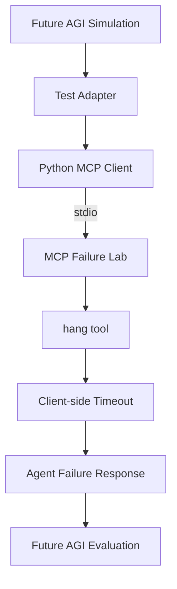

The repository includes four scenario files:

- `delay-success.json` — bounded delay with outcome and duration checks
- `delay-result.json` — MCP result assertions
- `hang-timeout.json` — expected timeout from the hanging tool
- `delay-observe-ping.json` — post-condition verification through `ping`

## Verify with MCP Inspector

```sh
npx @modelcontextprotocol/inspector npx mcp-failure-lab serve
```

Connect with stdio, list tools, select `ping`, and run it. Do not share temporary authentication tokens embedded in Inspector URLs.

## Observer verification

```sh
npm run dev -- run examples/scenarios/delay-observe-ping.json
```

This proves the server is responsive after the primary delay through a separate tool path on the same connection.

## Future AGI experiment

This example combines Future AGI simulation and evaluation with an independent Python MCP client and the published `mcp-failure-lab` package. It is an integration example, not an official Future AGI integration or endorsement.



*Figure 1. External validation path for the `hang` fault.*

### What was validated

The initial validation used:

- `mcp-failure-lab@0.3.2` from npm
- Future AGI simulation
- Python 3.12 and the Python MCP SDK
- stdio transport
- the real `hang` tool
- a three-second client-side timeout

The independent client started the published package through `npx`, initialized an MCP session, discovered the four built-in tools, invoked `hang`, and observed the request remain pending until the client timeout. The same interaction was then exercised from a Future AGI simulation.

Ten generated simulation calls completed. The evaluator also identified cases where the deliberately simple adapter became repetitive after the timeout. This distinction matters: Failure Lab reproduced the fault, while the external framework evaluated the agent's response.

### Run the example

The example requires Node.js, npm, Python 3.12, a Python virtual environment, and Future AGI credentials. Install the Python dependencies required by the example:

```sh
pip install agent-simulate mcp
```

Configure Future AGI credentials according to its SDK documentation, then run from the repository root:

```sh
python examples/integrations/futureagi/hang_test.py
```

Expected MCP diagnostics include:

```text
MCP connected: mcp-failure-lab@0.3.2
MCP tools: ['ping', 'delay', 'hang', 'disconnect']
Calling real MCP 'hang' tool (timeout=3s)...
MCP RESULT: hang timed out as expected
```

A successful fault reproduction means the server started, MCP initialization succeeded, `hang` was discoverable, and the independent client reached its configured timeout. Agent behavior after that timeout is evaluated separately.

The example currently validates only the `hang` fault. It does not add external-client orchestration to Failure Lab.

See [`examples/integrations/futureagi`](https://github.com/anilloutombam/mcp-failure-lab/tree/main/examples/integrations/futureagi) for the adapter, complete setup notes, and reproduction steps.
